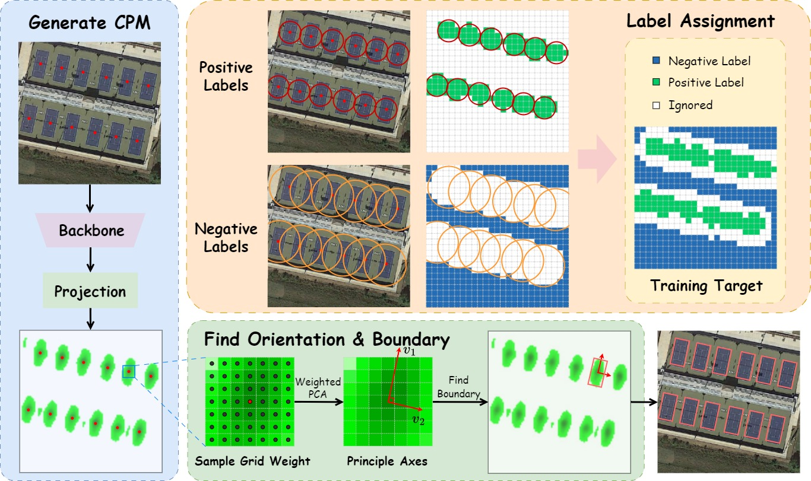

## **PointOBB-v2: Towards Simpler, Faster, and Stronger Single Point Supervised Oriented Object Detection**

[[paper]](https://arxiv.org/abs/2410.08210)

### ⭐️ Highlights

**TL;DR:** We propose PointOBB-v2, a simpler, faster, and stronger method to generate pseudo rotated boxes from points without relying on any other prior. It achieves a training speed 15.58x faster and an accuracy improvement of 11.60%/25.15%/21.19% on the DOTA-v1.0/v1.5/v2.0 datasets compared to the previous state-of-the-art, PointOBB.



### 🛠️ Installation

Please refer to the [Installation](https://github.com/open-mmlab/mmrotate/blob/main/README.md), we copy it here.

```
conda create -n open-mmlab python=3.7 pytorch==1.7.0 cudatoolkit=10.1 torchvision -c pytorch -y
conda activate open-mmlab
pip install openmim
mim install mmcv-full
mim install mmdet
git clone https://github.com/taugeren/PointOBB-v2.git
cd mmrotate
pip install -r requirements/build.txt
pip install -v -e .
```

### 📊 Data Preparation

Please follow [data_preparation](https://github.com/taugeren/PointOBB-v2/tree/master/tools/data) to prepare formatting data

### 🏋️ Train CPM

If you want to visualize CPM result during training, please set `visualize=True` in **train_config**

Please modified the config code that contains the **visualize directory path**

The learning rate for **`n` GPU card** and **batch size m** is `0.0125 * n * m`

For single GPU

```
# Basic format: python tools/train.py ${CONFIG_FILE} [optional arguments]
python tools/train.py configs/pointobbv2/train_cpm_dotav10.py --work-dir work_dirs/cpm_dotav10 --gpu-ids 0
```

For multiple GPU

```
# Basic format: ./tools/dist_train.sh ${CONFIG_FILE} ${GPU_NUM} [optional arguments]
CUDA_VISIBLE_DEVICES=0,1 PORT=29801 ./tools/dist_train.sh configs/pointobbv2/train_cpm_dotav10.py 2
```

### 🏋️ Generate Pseudo Label

Please modified the config code that contains the **directory path**

For single GPU

```
# Basic fromat: python tools/train.py ${CONFIG_FILE} --resume-from ${CPM_CHECKPOINT_FILE} [other arguments]
python tools/train.py configs/pointobbv2/generate_pseudo_label_dotav10.py --resume-from work_dirs/cpm_dotav10/epoch_6.pth --work-dir work_dirs/cpm_dotav10 --gpu-ids 0
```

For multiple GPU

```
# Basic format: ./tools/dist_train_resume.sh ${CONFIG_FILE} ${CPM_CHECKPOINT_FILE} ${GPU_NUM} [optional arguments]
CUDA_VISIBLE_DEVICES=0,1 PORT=29801 ./tools/dist_train_resume.sh /ssd1/renbotao/github_submission/mmrotate/configs/pointobbv2/generate_pseudo_label_dotav10.py work_dirs/cpm_dotav10/epoch_6.pth 2
```

### 🏋️ Train Detector

You can use different oriented object detection detector in [MMRotate Config](https://github.com/open-mmlab/mmrotate/tree/main/configs)

Please modify the **pseudo label path** in config file

For example, using Redet, the training command:

```
# single GPU
python tools/train.py configs/pointobbv2/redet_dotav10.py --work-dir work_dirs/cpm_dotav10 --gpu-ids 0

# multiple GPU
CUDA_VISIBLE_DEVICES=0,1 PORT=29801 ./tools/dist_train.sh configs/pointobbv2/redet_dotav10.py 2
```

the testing command:

```
# single GPU
python tools/test.py work_dirs/redet_dotav10/redet_dotav10.py work_dirs/redet_dotav10/epoch_12.pth --gpu-ids 0 --format-only --eval-options submission_dir=testmodel/redet_dotav10_epoch12

# multiple GPU
CUDA_VISIBLE_DEVICES=0,1,2,3 PORT=29816 tools/dist_test1.sh work_dirs/redet_dotav10/redet_dotav10.py work_dirs/redet_dotav10/epoch_12.pth 4
```

### 🚀 Released Models

|  Dataset  |                            Config                            |                             Log                              |                          Checkpoint                          |  mAP  |
| :-------: | :----------------------------------------------------------: | :----------------------------------------------------------: | :----------------------------------------------------------: | :---: |
| DOTA-v1.0 | [config](https://github.com/taugeren/PointOBB-v2/tree/main/configs/pointobbv2) | [quark](https://pan.quark.cn/s/72c9fb568db8)    [hugging face](https://huggingface.co/Tauger/PointOBB-v2/blob/main/log_dotav10.zip) | [quark](https://pan.quark.cn/s/72c9fb568db8)    [hugging face](https://huggingface.co/Tauger/PointOBB-v2/blob/main/checkpoint_dotav10.zip) | 44.85 |
| DOTA-v1.5 | [config](https://github.com/taugeren/PointOBB-v2/tree/main/configs/pointobbv2) | [quark](https://pan.quark.cn/s/85de4e0b1878)    [hugging face](https://huggingface.co/Tauger/PointOBB-v2/blob/main/log_dotav15.zip) | [quark](https://pan.quark.cn/s/85de4e0b1878)   [hugging face](https://huggingface.co/Tauger/PointOBB-v2/blob/main/checkpoint_dotav15.zip) | 36.39 |
| DOTA-v2.0 | [config](https://github.com/taugeren/PointOBB-v2/tree/main/configs/pointobbv2) | [quark](https://pan.quark.cn/s/aa555f111d43)    [hugging face](https://huggingface.co/Tauger/PointOBB-v2/blob/main/log_dotav20.zip) | [quark](https://pan.quark.cn/s/aa555f111d43)    [hugging face](https://huggingface.co/Tauger/PointOBB-v2/blob/main/checkpoint_dotav20.zip) | 27.22 |

## 🖊️ Citation

If you find this work helpful for your research, please consider giving this repo a star ⭐ and citing our papers:

```bibtex
@article{pointobbv2,
  title={PointOBB-v2: Towards Simpler, Faster, and Stronger Single Point Supervised Oriented Object Detection},
  author={Ren, Botao and Yang, Xue and Yu, Yi and Luo, Junwei and Deng, Zhidong},
  journal={arXiv preprint arXiv:2410.08210},
  year={2024}
}

@inproceedings{pointobb,
  title={PointOBB: Learning Oriented Object Detection via Single Point Supervision},
  author={Luo, Junwei and Yang, Xue and Yu, Yi and Li, Qingyun and Yan, Junchi and Li, Yansheng},
  booktitle={Proceedings of the IEEE/CVF Conference on Computer Vision and Pattern Recognition},
  pages={16730--16740},
  year={2024}
}

@inproceedings{point2rbox,
  title={Point2RBox: Combine Knowledge from Synthetic Visual Patterns for End-to-end Oriented Object Detection with Single Point Supervision},
  author={Yu, Yi and Yang, Xue and Li, Qingyun and Da, Feipeng and Dai, Jifeng and Qiao, Yu and Yan, Junchi},
  booktitle={Proceedings of the IEEE/CVF Conference on Computer Vision and Pattern Recognition},
  pages={16783--16793},
  year={2024}
}
```

## 📃 License

This project is released under the [Apache License 2.0](LICENSE). 
